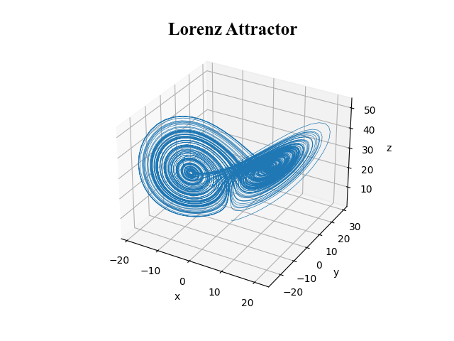
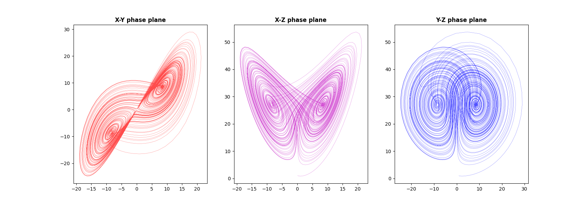

# Lorenz Attractor

The Lorenz system is a system of ordinary differential equations first studied by mathematician and meteorologist Edward Lorenz. It is notable for having chaotic solutions for certain parameter values and initial conditions. In particular, the Lorenz attractor is a set of chaotic solutions of the Lorenz system.

x′= σ (y − x)

y′= x (ρ − z) − y

z′= xy−βz

The equations relate the properties of a two-dimensional fluid layer uniformly warmed from below and cooled from above. 

In particular, the equations describe the rate of change of three quantities with respect to time: **X** is proportional to the rate of convection, **Y** to the horizontal temperature variation, and **Z** to the vertical temperature variation. The constants **σ, ρ,** and **β** are system parameters proportional to the **Prandtl number**, **Rayleigh number**, and certain physical dimensions of the layer itself.
